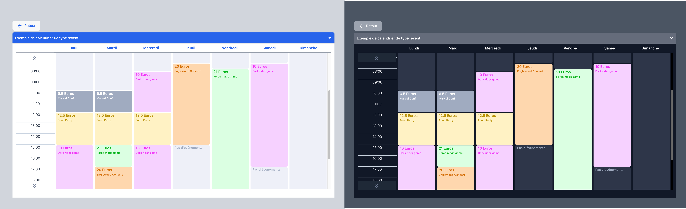
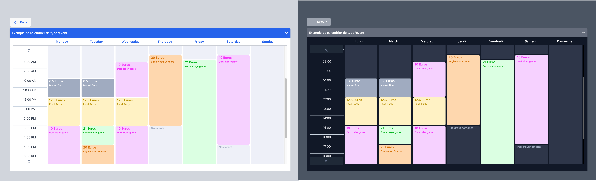
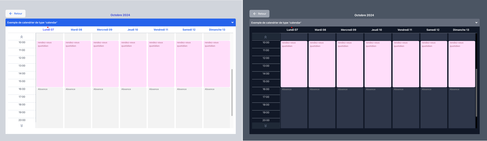
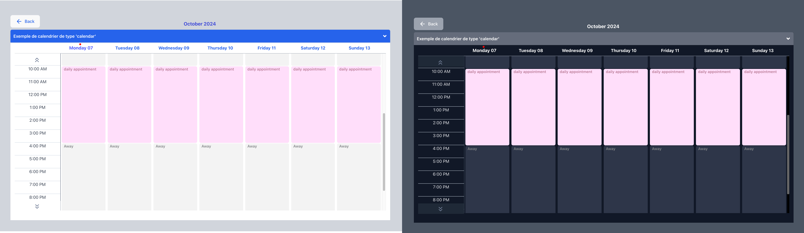

[](https://www.npmjs.com/package/react-simple-schedule-viewer) 

# WORK IN PROGRESS...

# React simple schedule viewer

## 📅 An easy configurable react weekly Calendar viewer component.

---

- Full Typescript support
- Dark & Light mode support
- French & English languages support
- Schedule view with three types : 'event', 'temperature' & 'calendar'
- made with react, react-router-dom, tailwindcss & recoil
- With only one peer dependency other than react & react-dom -> react-router-dom

---

## pictures demo :

> ### Event type:
>
> French - Light & Dark mode
> 
>
> English - Light & Dark mode
> 

> ### Temperature type:
>
> French - Light & Dark mode
> 
>
> English - Light & Dark mode
> 

> ### Calendar type:
>
> French - Light & Dark mode
> 
>
> English - Light & Dark mode
> 

### Live demo

> To see the live demo:
> [Click here](https://bright-jalebi-193c3a.netlify.app/)

### install dependency

- as react-router-dom is a peer dependency, you need to install it first.

```
yarn add react-router-dom
```

> of course, like all react application wich use react router dom, you need to wrap your App element with a provider into the main.tsx page like that:

```javascript
// main.tsx
  ...
  <BrowserRouter>
    <App />
  </BrowserRouter>
  ...
```

## install library

```
npm install react-simple-schedule-viewer
```

or

```
yarn add react-simple-schedule-viewer
```

## API

| Name                 | Type               | Default                                | Description                                                                    |
| -------------------- | ------------------ | -------------------------------------- | ------------------------------------------------------------------------------ |
| scheduleByEventPlace | Object (required)  | `{ schedules: [] }`                    | The data object for the schedule.                                              |
| weekStartsOn         | Number (required)  | `0`                                    | The day of the week start                                                      |
| isInDarkMode         | Boolean (required) | `false`                                | For dark mode support.                                                         |
| colorCellByEvents    | Object (required)  | `{ eventType_1: "", eventType_6: "" }` | The colors of the cells.                                                       |
| eventsTextColor      | Object (required)  | `{ eventType_1: "", eventType_6: "" }` | the color for the text cells calendar.                                         |
| locale               | String (required)  | `"fr" `                                | for fr/en support.                |
| eventsNameUs         | Object (optional)  | `{ eventType_1: "", eventType_6: "" }` | the events name in us version.                                                 |
| eventsName           | Object (optional)  | `{ eventType_1: "", eventType_6: "" }` | the events name in fr version.                                                 |
| eventTypeData        | Object (required)  | `{ eventType_1: "", eventType_6: "" }` | The value of each event (prices, degrees, or other infos).                                                       |
| modalContent         | Array (optional)   | `[]`                                   | Custom modal content (event type only)                                         |
| withDays             | boolean (optional) | `false`                                | display the day of each week days.                                             |
| withList             | Boolean (optional) | `false`                                | display a list of the schedules before the calendar view.                      |
| withListButtonName   | String (optional)  | `""`                                   | when the list is true you can add a french text for the return button |
| withListButtonNameUs | String (optional)  | `""`                                   |  you can add an English text for the button                                                         |
| withListReturnButton | Boolean (optional) | `false`                                | when the list is true you can add a return button by setting the value to true |                                                         |

## Usage

> ### important
>
> > ### the time value expected is only in minutes from 0 to 1440.
> >
> > ### the expected range is by 15 min intervals only
>
> > > #### [Link to the complete 24h values by 15 mins range ](./HOURSRANGE.md "full range of value from 0 to 1440")

### Event type calendar view

> This example is implemented with fake data for easily copy/paste in your project & adding more convenience for understanding the logic.

> #### you can see the example code: [here](/examples/)

```javascript
// App.tsx
import { Suspense, useEffect, useState } from "react";
import "../App.css";
import { Route, Routes } from "react-router-dom";
// If you don't have light & dark theme, you can skip this import & set false to isInDarkMode Schedule props 
import { useTheme } from "../useTheme";
// All types for the Schedule
import {
  TcolorCellByEvents,
  TeventsTextColor,
} from "../dataTypes";
// The content for each event modal
import { contentForModal } from "./dataCards";
// Home page example
import HomePage from "../HomePage";
// The enum for the event types & all data for the schedule cells
import { EeventTypes, eventTypeData, scheduleByEventPlace } from "./eventData";
//Import for the npm registry
import Schedule from "react-simple-schedule-viewer";

function App() {
  //  Variables for the Schedule component
  const weekStartsOn = 0;
  const { theme, setTheme } = useTheme();
  const [isDarkMode] = useState(theme === "dark" ? true : false);

  // the default order of background colors in the array is
  const colorCellByEvents: TcolorCellByEvents = {
    [EeventTypes.food]: "#FFF2C4", // eventType_1 - required
    [EeventTypes.concert]: "#FED7AD", // eventType_2 - optional
    [EeventTypes.game_force]: "#DBFFE2", // eventType_3 - optional
    [EeventTypes.game_dark]: "#F6D1FF", // eventType_4 - optional
    [EeventTypes.lecture]: "#A0ABC0", // eventType_5 - optional
    [EeventTypes.closed]: isDarkMode ? "#2D3648" : "#EDF0F7", // eventType_6 - required - is always the away, closed or absent event
    // eventType_7: "#B0DCFF", // eventType_7 - optional - unused in this example
  };
  // the default order of text colors in the array is
  const eventsTextColor: TeventsTextColor = {
    [EeventTypes.food]: "#B99100", // eventType_1 - required
    [EeventTypes.concert]: "#D46E00", // eventType_2 - optional
    [EeventTypes.game_force]: "#00B51E", // eventType_3 - optional
    [EeventTypes.game_dark]: "#F134F7", // eventType_4 - optional
    [EeventTypes.lecture]: "#FFFFFF", // eventType_5 - optional
    [EeventTypes.closed]: "#a0abc0", // eventType_6 - required - is always the away, closed or absent event
    // eventType_7: "#0196EC", // eventType_7 - optional -- unused in this example
  };

// Just for the demo
  useEffect(() => {
    if (isDarkMode) {
      setTheme("dark");
    } else if (!isDarkMode) {
      setTheme("light");
    }
  });

  return (
    <div className="App">
      <Routes>
        <Route path="/" element={<HomePage />} /> 
        <Route
          path="/schedule/*" // The path imperatively must be '/schedule/*'
          element={
            <Suspense fallback={<div>Loading...</div>}>
              <Schedule
                scheduleByEventPlace={scheduleByEventPlace}
                weekStartsOn={weekStartsOn}
                isInDarkMode={isDarkMode}
                colorCellByEvents={colorCellByEvents}
                eventsTextColor={eventsTextColor}
                locale={"fr"}
                eventTypeData={eventTypeData}
                modalContent={contentForModal}
                  // If you want to display the number of the day on each day names
                // withDays={false}
                  // If you want to display a list with all schedules before the calendar view 
                // withList={false}
                  // If you want to display a return button to the list of schedules 
                // withListReturnButton={true}
                  // If you display a return button, the french button text 
                // withListButtonName="Retourner à la page d'acceuil"
                  // If you display a return button, the english button text 
                // withListButtonNameUs="Go to HomePage"
                
              />
            </Suspense>
          }
        />
      </Routes>
    </div>
  );
}

export default App;

```


### The Typescript types file

```javascript
// dataTypes.ts
export interface getSchedulesByEventPlaceIdResponse {
  schedules: {
    id: string;
    title: string;
    type: string;
    day_slot_set: {
      days: number[];
      time_slot: {
        start: number;
        instruction: string;
      }[];
    }[];
  }[];
}
export type TeventTypeData = {
  eventPlace_id?: string;
  eventType_1: string;
  eventType_2?: string;
  eventType_3?: string;
  eventType_4?: string;
  eventType_5?: string;
  eventType_6: string;
  eventType_7?: string;
};
export type TcolorCellByEvents = Omit<TeventTypeData, "eventPlace_id">;

export type TeventsTextColor = Omit<TeventTypeData, "eventPlace_id">;

export enum LanguageKeys {
  en = "en",
  fr = "fr",
}


export type TeventsName = {
  eventType_1: string;
  eventType_2?: string;
  eventType_3?: string;
  eventType_4?: string;
  eventType_5?: string;
  eventType_6: string;
  eventType_7?: string;
}
```

### the data file

```javascript
// eventData.ts
  import { getSchedulesByEventPlaceIdResponse, TeventTypeData } from "../../dataTypes";

  //  enum for identidying the event_Type easily
  export enum EeventTypes {
    food = "eventType_1",
    concert = "eventType_2",
    game_force = "eventType_3",
    game_dark = "eventType_4",
    lecture = "eventType_5",
    closed = "eventType_6", // eventType_6 must be always the away, closed or no activity event
    appointement = "eventType_7",
  }
  //   Mocked data for example - set the price of each event for example
  export const eventTypeData: TeventTypeData = {
    eventPlace_id: "e2076d6a-9d6d-4b93-9ce0-a41f04c38c40", // If you have many places with different prices this id must be unique
    [EeventTypes.food]: "12.5 Euros",
    [EeventTypes.concert]: "20 Euros",
    [EeventTypes.game_force]: "21 Euros",
    [EeventTypes.game_dark]: "10 Euros",
    [EeventTypes.lecture]: "6.5 Euros",
    [EeventTypes.closed]: "",
  };

  //   Mocked data for example - schedules array with each calendar cells event
  export const scheduleByEventPlace: getSchedulesByEventPlaceIdResponse = {
    schedules: [
      {
        id: "a397f1fe-14bf-4ca3-af8c-e497b98451f7", // Unique schedule id identifier
        title: "Exemple de calendrier de type 'event'", // title of the event
        type: "event", // type of the event (event - temperature - calendar)
        day_slot_set: [
          // each days & time slot instruction, start time only & the type of event (eventType_1 for example)
          {
            days: [0], // Monday
            time_slot: [
              {
                start: 0, // start at midnight with closed type event
                instruction: EeventTypes.closed,
              },
              {
                start: 600, // start at 10:00AM (this is the end of the previous event too)
                instruction: EeventTypes.lecture,
              },
              {
                start: 720, // start at 12:00AM with food (eventType_1 in this example)
                instruction: EeventTypes.food,
              },
              {
                start: 900,
                instruction: EeventTypes.game_dark,
              },
              {
                start: 1230,
                instruction: EeventTypes.concert,
              },
              {
                start: 1380,
                instruction: EeventTypes.closed,
              },
            ],
          },
          {
            days: [1],
            time_slot: [
              {
                start: 0,
                instruction: EeventTypes.closed,
              },
              {
                start: 600,
                instruction: EeventTypes.lecture,
              },
              {
                start: 720,
                instruction: EeventTypes.food,
              },
              {
                start: 900,
                instruction: EeventTypes.game_force,
              },
              {
                start: 1020,
                instruction: EeventTypes.concert,
              },

              {
                start: 1380,
                instruction: EeventTypes.closed,
              },
            ],
          },
          {
            days: [2],
            time_slot: [
              {
                start: 0,
                instruction: EeventTypes.closed,
              },
              {
                start: 495,
                instruction: EeventTypes.game_dark,
              },
              {
                start: 720,
                instruction: EeventTypes.food,
              },
              {
                start: 900,
                instruction: EeventTypes.game_dark,
              },
              {
                start: 1215,
                instruction: EeventTypes.closed,
              },
            ],
          },
          {
            days: [3],
            time_slot: [
              {
                start: 0,
                instruction: EeventTypes.closed,
              },
              {
                start: 450,
                instruction: EeventTypes.concert,
              },
              {
                start: 900,
                instruction: EeventTypes.closed,
              },
            ],
          },
          {
            days: [4],
            time_slot: [
              {
                start: 0,
                instruction: EeventTypes.closed,
              },

              {
                start: 480,
                instruction: EeventTypes.game_force,
              },
              {
                start: 1380,
                instruction: EeventTypes.closed,
              },
            ],
          },
          {
            days: [5],
            time_slot: [
              {
                start: 0,
                instruction: EeventTypes.closed,
              },
              {
                start: 450,
                instruction: EeventTypes.game_dark,
              },
              {
                start: 1020,
                instruction: EeventTypes.closed,
              },
            ],
          },
          {
            days: [6],
            time_slot: [
              {
                start: 0,
                instruction: EeventTypes.closed,
              },
            ],
          },
        ],
      },
    ],
  };

```

### The contentForModal data

```javascript
// dataCards.tsx
import { Fragment } from "react/jsx-runtime";
import { EeventTypes } from "./enum";

export const contentForModal = [
  {
    id: "a397f1fe-14bf-4ca3-af8c-e497b98451f7", // The id of the schedule
    day: 0, // The day of the event
    eventType: EeventTypes.concert, // The event type - for this example it's the eventType_2 based with the enum name
    startTime: 1230, // The start time of the event - the end of this event is defined by the next start time event
    eventTitle: "Englewood Concert", // The title
    contentModal: ( // This variable get the JSX Element you want, can be card, external component...
      <Fragment>
        <h1 style={{ fontWeight: "bold", padding: 10 }}>
          Event de lundi à 20:30 et réservation
        </h1>
        <p>This is the place for the custom element (JSXElement)</p>
        <p>
          Lorem ipsum dolor sit amet consectetur adipisicing elit. Dicta
          quibusdam delectus esse! Excepturi, omnis sapiente at quo tempora
          eaque repellendus, a aspernatur impedit reiciendis laborum optio sed
          quasi cupiditate amet.
        </p>
      </Fragment>
    ),
  },
  {
    id: "a397f1fe-14bf-4ca3-af8c-e497b98451f7",
    day: 3,
    eventType: EeventTypes.concert,
    startTime: 450,
    eventTitle: "Englewood Concert",
    contentModal: (
      <Fragment>
        <h1 style={{ fontWeight: "bold", padding: 10 }}>
          Event de jeudi à 07:30 et réservation
        </h1>
        <p style={{marginBottom:"1vh"}}>This is the place for the custom element (JSXElement)</p>
        <h2 style={{fontWeight:"bold"}}>Text example</h2>
         <p>
          Lorem ipsum dolor sit amet consectetur adipisicing elit. Dicta
          quibusdam delectus esse! Excepturi, omnis sapiente at quo tempora
          eaque repellendus, a aspernatur impedit reiciendis laborum optio sed
          quasi cupiditate amet.
        </p>
      </Fragment>
    ),
  },
  {
    id: "a397f1fe-14bf-4ca3-af8c-e497b98451f7",
    day: 1,
    eventType: EeventTypes.concert,
    startTime: 1020,
    eventTitle: "Englewood Concert",
    contentModal: (
      <Fragment>
        <h1 style={{ fontWeight: "bold", padding: 10 }}>
          Event du mardi à 17h info et réservation
        </h1>
        <p>This is the place for the custom element (JSXElement)</p>
         <h2 style={{fontWeight:"bold"}}>Text example</h2>
         <p>
          Lorem ipsum dolor sit amet consectetur adipisicing elit. Dicta
          quibusdam delectus esse! Excepturi, omnis sapiente at quo tempora
          eaque repellendus, a aspernatur impedit reiciendis laborum optio sed
          quasi cupiditate amet.
        </p>
      </Fragment>
    ),
  },
  {
    id: "a397f1fe-14bf-4ca3-af8c-e497b98451f7",
    day: 1,
    eventType: EeventTypes.game_force,
    startTime: 900,
    eventTitle: "Force mage game",
    contentModal: (
      <Fragment>
        <h1 style={{ fontWeight: "bold", padding: 10 }}>
          Event du mardi à 15h00 info
        </h1>
        <p>This is the place for the custom element (JSXElement)</p>
         <h2 style={{fontWeight:"bold"}}>Text example</h2>
         <p>
          Lorem ipsum dolor sit amet consectetur adipisicing elit. Dicta
          quibusdam delectus esse! Excepturi, omnis sapiente at quo tempora
          eaque repellendus, a aspernatur impedit reiciendis laborum optio sed
          quasi cupiditate amet.
        </p>
      </Fragment>
    ),
  },
  {
    id: "a397f1fe-14bf-4ca3-af8c-e497b98451f7",
    day: 4,
    eventType: EeventTypes.game_force,
    startTime: 480,
    eventTitle: "Force mage game",
    contentModal: (
      <Fragment>
        <h1 style={{ fontWeight: "bold", padding: 10 }}>
          Event du vendredi à 08h00 info
        </h1>
        <p>This is the place for the custom element (JSXElement)</p>
         <h2 style={{fontWeight:"bold"}}>Text example</h2>
         <p>
          Lorem ipsum dolor sit amet consectetur adipisicing elit. Dicta
          quibusdam delectus esse! Excepturi, omnis sapiente at quo tempora
          eaque repellendus, a aspernatur impedit reiciendis laborum optio sed
          quasi cupiditate amet.
        </p>
      </Fragment>
    ),
  },
  {
    id: "a397f1fe-14bf-4ca3-af8c-e497b98451f7",
    day: 5,
    eventType: EeventTypes.game_dark,
    startTime: 450,
    eventTitle: "Dark rider game",
    contentModal: (
      <Fragment>
        <h1 style={{ fontWeight: "bold", padding: 10 }}>
          Event du samedi à 07:30 info
        </h1>
        <p>This is the place for the custom element (JSXElement)</p>
         <h2 style={{fontWeight:"bold"}}>Text example</h2>
         <p>
          Lorem ipsum dolor sit amet consectetur adipisicing elit. Dicta
          quibusdam delectus esse! Excepturi, omnis sapiente at quo tempora
          eaque repellendus, a aspernatur impedit reiciendis laborum optio sed
          quasi cupiditate amet.
        </p>
      </Fragment>
    ),
  },
  {
    id: "a397f1fe-14bf-4ca3-af8c-e497b98451f7",
    day: 2,
    eventType: EeventTypes.game_dark,
    startTime: 495,
    eventTitle: "Dark rider game",
    contentModal: (
      <Fragment>
        <h1 style={{ fontWeight: "bold", padding: 10 }}>
          Event du mercredi à 08:15 info
        </h1>
        <p>This is the place for the custom element (JSXElement)</p>
         <h2 style={{fontWeight:"bold"}}>Text example</h2>
         <p>
          Lorem ipsum dolor sit amet consectetur adipisicing elit. Dicta
          quibusdam delectus esse! Excepturi, omnis sapiente at quo tempora
          eaque repellendus, a aspernatur impedit reiciendis laborum optio sed
          quasi cupiditate amet.
        </p>
      </Fragment>
    ),
  },
  {
    id: "a397f1fe-14bf-4ca3-af8c-e497b98451f7",
    day: 2,
    eventType: EeventTypes.game_dark,
    startTime: 900,
    eventTitle: "Dark rider game",
    contentModal: (
      <Fragment>
        <h1 style={{ fontWeight: "bold", padding: 10 }}>
          Event du mercredi à 15:00 info
        </h1>
        <p>This is the place for the custom element (JSXElement)</p>
         <h2 style={{fontWeight:"bold"}}>Text example</h2>
         <p>
          Lorem ipsum dolor sit amet consectetur adipisicing elit. Dicta
          quibusdam delectus esse! Excepturi, omnis sapiente at quo tempora
          eaque repellendus, a aspernatur impedit reiciendis laborum optio sed
          quasi cupiditate amet.
        </p>
      </Fragment>
    ),
  },
  {
    id: "a397f1fe-14bf-4ca3-af8c-e497b98451f7",
    day: 0,
    eventType: EeventTypes.lecture,
    eventTitle: "Marvel Conf",
    startTime: 600,
    contentModal: (
      <Fragment>
        <h1 style={{ fontWeight: "bold", padding: 10 }}>
          session de discussion sur les revues Marvel
        </h1>
        <p>This is the place for the custom element (JSXElement)</p>
         <h2 style={{fontWeight:"bold"}}>Text example</h2>
         <p>
          Lorem ipsum dolor sit amet consectetur adipisicing elit. Dicta
          quibusdam delectus esse! Excepturi, omnis sapiente at quo tempora
          eaque repellendus, a aspernatur impedit reiciendis laborum optio sed
          quasi cupiditate amet.
        </p>
      </Fragment>
    ),
  },
  {
    id: "a397f1fe-14bf-4ca3-af8c-e497b98451f7",
    day: 0,
    eventType: EeventTypes.game_dark,
    startTime: 900,
    eventTitle: "Dark rider game",
    contentModal: (
      <Fragment>
        <h1 style={{ fontWeight: "bold", padding: 10 }}>
          Event du lundi à 15:00 info
        </h1>
        <p>This is the place for the custom element (JSXElement)</p>
         <h2 style={{fontWeight:"bold"}}>Text example</h2>
         <p>
          Lorem ipsum dolor sit amet consectetur adipisicing elit. Dicta
          quibusdam delectus esse! Excepturi, omnis sapiente at quo tempora
          eaque repellendus, a aspernatur impedit reiciendis laborum optio sed
          quasi cupiditate amet.
        </p>
      </Fragment>
    ),
  },
  {
    id: "a397f1fe-14bf-4ca3-af8c-e497b98451f7",
    day: 1,
    eventType: EeventTypes.lecture,
    eventTitle: "Marvel Conf",
    startTime: 600,
    contentModal: (
      <Fragment>
        <h1 style={{ fontWeight: "bold", padding: 10 }}>
          session de discution sur les revues Marvel
        </h1>
        <p>This is the place for the custom element (JSXElement)</p>
         <h2 style={{fontWeight:"bold"}}>Text example</h2>
         <p>
          Lorem ipsum dolor sit amet consectetur adipisicing elit. Dicta
          quibusdam delectus esse! Excepturi, omnis sapiente at quo tempora
          eaque repellendus, a aspernatur impedit reiciendis laborum optio sed
          quasi cupiditate amet.
        </p>
      </Fragment>
    ),
  },
  {
    id: "a397f1fe-14bf-4ca3-af8c-e497b98451f7",
    day: 0,
    eventType: EeventTypes.food,
    eventTitle: "Food Party",
    startTime: 720,
    contentModal: (
      <Fragment>
        <h1 style={{ fontWeight: "bold", padding: 10 }}>
          Event du lundi à 12:00 info
        </h1>
        <p>This is the place for the custom element (JSXElement)</p>
         <h2 style={{fontWeight:"bold"}}>Text example</h2>
         <p>
          Lorem ipsum dolor sit amet consectetur adipisicing elit. Dicta
          quibusdam delectus esse! Excepturi, omnis sapiente at quo tempora
          eaque repellendus, a aspernatur impedit reiciendis laborum optio sed
          quasi cupiditate amet.
        </p>
      </Fragment>
    ),
  },
  {
    id: "a397f1fe-14bf-4ca3-af8c-e497b98451f7",
    day: 1,
    eventType: EeventTypes.food,
    eventTitle: "Food Party",
    startTime: 720,
    contentModal: (
      <Fragment>
        <h1 style={{ fontWeight: "bold", padding: 10 }}>
          Event du mardi à 12:00 info
        </h1>
        <p>This is the place for the custom element (JSXElement)</p>
         <h2 style={{fontWeight:"bold"}}>Text example</h2>
         <p>
          Lorem ipsum dolor sit amet consectetur adipisicing elit. Dicta
          quibusdam delectus esse! Excepturi, omnis sapiente at quo tempora
          eaque repellendus, a aspernatur impedit reiciendis laborum optio sed
          quasi cupiditate amet.
        </p>
      </Fragment>
    ),
  },
  {
    id: "a397f1fe-14bf-4ca3-af8c-e497b98451f7",
    day: 2,
    eventType: EeventTypes.food,
    eventTitle: "Food Party",
    startTime: 720,
    contentModal: (
      <Fragment>
        <h1 style={{ fontWeight: "bold", padding: 10 }}>
          Event du lundi à 12:00 info
        </h1>
        <p>This is the place for the custom element (JSXElement)</p>
         <h2 style={{fontWeight:"bold"}}>Text example</h2>
         <p>
          Lorem ipsum dolor sit amet consectetur adipisicing elit. Dicta
          quibusdam delectus esse! Excepturi, omnis sapiente at quo tempora
          eaque repellendus, a aspernatur impedit reiciendis laborum optio sed
          quasi cupiditate amet.
        </p>
      </Fragment>
    ),
  },
];

```

## The HomePage (for demo)

```javascript
import { Link } from "react-router-dom";

const HomePage = () => {
  return (
    <div>
       <Link style={{fontSize:18}}
        data-testid="demo-button"
        to={`/schedule/`}
      >
        Go to demo...
      </Link>
      <h1>Go to Schedule view</h1>
     
    </div>
  );
};

export default HomePage;

```


## Contributions Welcome!

```shell
git clone https://github.com/rodolphe37/react-simple-schedule-viewer
```

## License

The ISC License.
