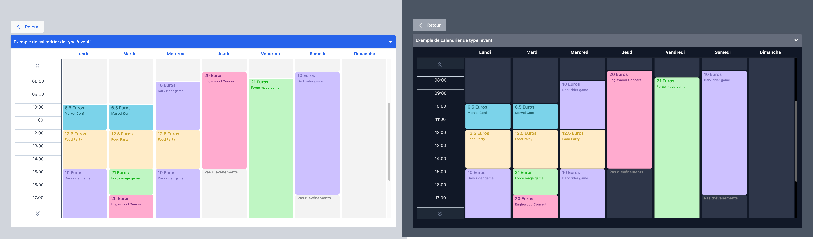
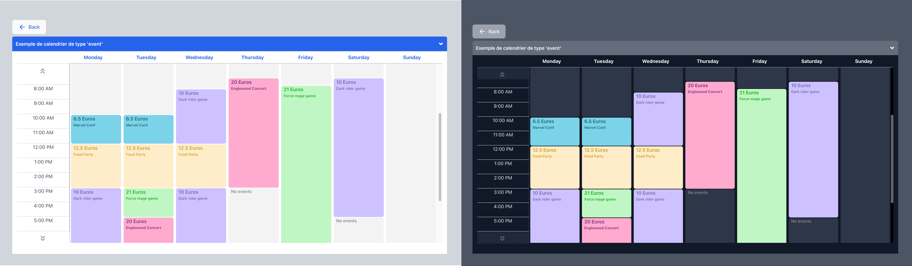

[](https://www.npmjs.com/package/react-simple-schedule-viewer) 

# React simple schedule viewer

📅 An easy configurable weekly Calendar viewer component.

---

- Full Typescript support
- Dark & Light mode support
- French & English languages support
- Schedule view with three types : 'event', 'temperature' & 'calendar'
- made with react-router-dom, tailwindcss & recoil
- With only one peer dependency other than react & react-dom -> react-router-dom

---

## pictures demo :

> ### Event type:
>
> French - Light & Dark mode
> 
>
> English - Light & Dark mode
> 

> ### Temperature type:
>
> French - Light & Dark mode
> 
>
> English - Light & Dark mode
> 

> ### Calendar type:
>
> French - Light & Dark mode
> 
>
> English - Light & Dark mode
> 

### Live demo

> To see the live demo:
> [Click here](https://bright-jalebi-193c3a.netlify.app/)

### install dependency

- as react-router-dom is a peer dependency, you need to install it first.

```
yarn add react-router-dom
```

> of course, like all react application wich use react router dom, you need to wrap your App element with a provider into the main.tsx page like that:

```javascript
// main.tsx
  ...
  <BrowserRouter>
    <App />
  </BrowserRouter>
  ...
```

## install library

```
npm install react-simple-schedule-viewer
```

or

```
yarn add react-simple-schedule-viewer
```

## API

| Name                 | Type               | Default                                | Description                                                                    |
| -------------------- | ------------------ | -------------------------------------- | ------------------------------------------------------------------------------ | --- |
| scheduleByEventPlace | Object (required)  | `{ schedules: [] }`                    | The data object for the schedule.                                              |
| weekStartsOn         | Number (required)  | `0`                                    | The day of the week start                                                      |
| isInDarkMode         | Boolean (required) | `false`                                | For dark mode support.                                                         |
| colorCellByEvents    | Object (required)  | `{ eventType_1: "", eventType_6: "" }` | The colors of the cells.                                                       |
| eventsTextColor      | Object (required)  | `{ eventType_1: "", eventType_6: "" }` | the color for the text cells calendar.                                         |
| locale               | String (required)  | `"fr" `                                | The initial value that the picker begin with in the first time.                |
| eventsNameUs         | Object (optional)  | `{ eventType_1: "", eventType_6: "" }` | the events name in us version.                                                 |
| eventsName           | Object (optional)  | `{ eventType_1: "", eventType_6: "" }` | the events name in fr version.                                                 |
| eventTypeData        | Object (required)  | `{ eventType_1: "", eventType_6: "" }` | The value of each event.                                                       |
| modalContent         | Array (optional)   | `[]`                                   | Custom modal content (event type only)                                         |
| withDays             | boolean (optional) | `false`                                | display the day of each week days.                                             |
| withList             | Boolean (optional) | `false`                                | display a list of the schedules before the calendar view.                      |
| withListButtonName   | String (optional)  | `""`                                   | when the list is true you can add a french text for the return button          |
| withListButtonNameUs | String (optional)  | `""`                                   | when the list is true you can add an English text for the return button        |
| withListReturnButton | Boolean (optional) | `false`                                | when the list is true you can add a return button by setting the value to true |

## Usage

> ### important
>
> > the time value expected is only in minutes from 0 to 1440.
>
> > the expected range is by 15 min intervals only
>
> [Link to the complete 24h values by 15 mins range ](./HOURSRANGE.md "full range of value from 0 to 1440")

### 24 hours format (light & dark)


```javascript
import React, { useState } from 'react';
import { TimePicker } from 'react-wheel-time-picker';

export default const  App = () => {
    const [value, setValue] = useState('12:00');
    const [isDarkMode, setIsDarkMode] = useState(false);

    const onChange = (timeValue: string) => {
    setValue(timeValue);
    };

   return (
      <div>
        <TimePicker
            label="Start time"
            isDarkMode={isDarkMode}
            onChange={onChange}
            value={value}
        />
      </div>
   );
}
```

### 12 hours format (light & dark)


```js
import React, { useState } from 'react';
import { TimePicker } from 'react-wheel-time-picker';

export default const  MyApp = () => {
    const [value, setValue] = useState('10:00 AM');
    const [isDarkMode, setIsDarkMode] = useState(false);

    const onChange = (timeValue) => {
        setValue(timeValue);
    }

   return (
      <div>
        <TimePicker
            use12Hours
            label="Start time"
            isDarkMode={isDarkMode}
            onChange={onChange}
            value={value}
        />
      </div>
   );
}
```

## Contributions Welcome!

```shell
git clone https://github.com/rodolphe37/react-wheel-time-picker
```

## License

The ISC License.
