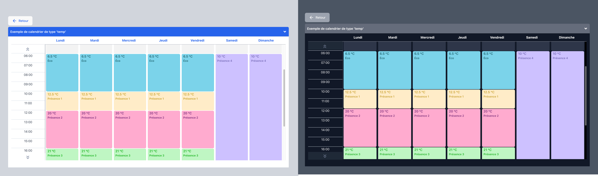

[](https://www.npmjs.com/package/react-simple-schedule-viewer) 

# WORK IN PROGRESS...

# React simple schedule viewer

## 📅 An easy configurable react weekly Calendar viewer component.

---

- Full **Typescript** support
- **Dark & Light** mode support
- **French & English** languages support
- Schedule view with three types : **'event'**, **'temperature'** & **'calendar'**
- made with react, react-router-dom, tailwindcss & recoil
- With only one peer dependency other than react & react-dom -> **react-router-dom**

---

## Quick Links

[Pictures demo](#pictures-demo)

[Live demo](#Live-demo)

[Install dependency](#install-dependency)

[Install library](#install-library)

[API](#API)

[Usage](#dart-Usage)

  - [Event type view](#circus_tent-Event-type-view)

  - [Temp type view](#hotsprings-temperature-type-view)

  - [Calendar type](#calendar-calendar-type-view)


[Contributing](#pencil2-Contributing)

[Reporting Issues](#Reporting-Issues)

[Author](#bust_in_silhouette-author)

[Feature Requests](#Feature-Requests)

[A few words from the author](#large_blue_diamond-a-few-words-from-the-author)

[Support the project](#sparkling_heart-support-the-project)

[License](#scroll-license)

[My other projects](#my-other-projects)

---

## pictures demo

> ### Event type:
>
> French - Light & Dark mode
> 
>
> English - Light & Dark mode
> 

> ### Temperature type:
>
> French - Light & Dark mode
> 
>
> English - Light & Dark mode
> 

> ### Calendar type:
>
> French - Light & Dark mode
> 
>
> English - Light & Dark mode
> 
---
> ### Some cool features:
>
> start & end time indication (only in french for the moment, sorry!)
>
> 
>
---
> Auto scroll to the first event.
>
> 
>
---
> custom modal content (only for the 'event' type of schedule).
>
> 
>
>The normal modal for all other schedule types is:
>
>

## Live demo

> To see the live demo:
> [Click here](https://steady-hamster-02673e.netlify.app/)

## install dependency

- as react-router-dom is a peer dependency, you need to install it first.

```
yarn add react-router-dom
```

> of course, like all react application wich use react router dom, you need to wrap your App element with a provider into the main.tsx page like that:

```javascript
// main.tsx
  ...
  <BrowserRouter>
    <App />
  </BrowserRouter>
  ...
```

## install library

```
npm install react-simple-schedule-viewer
```

or

```
yarn add react-simple-schedule-viewer
```

## API

| Name                 | Type               | Default                                | Description                                                                    |
| -------------------- | ------------------ | -------------------------------------- | ------------------------------------------------------------------------------ |
| scheduleByEventPlace | Object (required)  | `{ schedules: [] }`                    | The data object for the schedule.                                              |
| weekStartsOn         | Number (required)  | `0`                                    | The day of the week start                                                      |
| isInDarkMode         | Boolean (required) | `false`                                | For dark mode support.                                                         |
| colorCellByEvents    | Object (required)  | `{ eventType_1: "", eventType_6: "" }` | The colors of the cells.                                                       |
| eventsTextColor      | Object (required)  | `{ eventType_1: "", eventType_6: "" }` | the color for the text cells calendar.                                         |
| locale               | String (required)  | `"fr" `                                | for fr/en support.                |
| eventsNameUs         | Object (optional)  | `{ eventType_1: "", eventType_6: "" }` | the events name in us version.                                                 |
| eventsName           | Object (optional)  | `{ eventType_1: "", eventType_6: "" }` | the events name in fr version.                                                 |
| eventTypeData        | Object (required)  | `{ eventType_1: "", eventType_6: "" }` | The value of each event (prices, degrees, or other infos).                                                       |
| modalContent         | Array (optional)   | `[]`                                   | Custom modal content (event type only)                                         |
| withDays             | boolean (optional) | `false`                                | display the day of each week days.                                             |
| withList             | Boolean (optional) | `false`                                | display a list of the schedules before the calendar view.                      |
| withListButtonName   | String (optional)  | `""`                                   | when the list is true you can add a french text for the return button |
| withListButtonNameUs | String (optional)  | `""`                                   |  you can add an English text for the button                                                         |
| withListReturnButton | Boolean (optional) | `false`                                | when the list is true you can add a return button by setting the value to true |                                                         |


## Some precision about options

#### All options are available in english language too, without intl or i18n...
---
> - weekStartsOn : 
>
> you can choice the default day of the beginning of the schedule.
>
---
---
> - eventsNameUs & eventsName & modalContent : 
>
> These three variables are used only for the 'event' type schedule. for the other types you don't need to implement it.
>
---
---
> - withDays : 
>
> That variable display the current month on top & indicate the current day with a red point & a more stronger font size. This option is by default for the calendar type (in this case, it's no need to put this variable to the Schedule props).
>
> 
> 

---
---

> - withList :
>
> This option display a list of your schedules before the calendar view, with a return button logic.
>
> 
> 

---
---

> - withListReturnButton :
>
> This option display a button to return to your home page for example. This option is used when the withList boolean is true.
>
> Example : 
> ```javascript
> withListReturnButton={true}
> withListButtonName="Retourner à la page d'acceuil"
> withListButtonNameUs="Go to HomePage"

> ```

> 
> 

---

## :dart: Usage

> ### :heavy_exclamation_mark: important
>
> > ### :heavy_exclamation_mark: the time value expected is only in minutes from 0 to 1440.
> >
> > ###  :heavy_exclamation_mark: the expected range is by 15 min intervals only
>
> > > #### [Link to the complete 24h values by 15 mins range ](./HOURSRANGE.md "full range of value from 0 to 1440")

## :circus_tent: Event type view

> This example is implemented with fake data for easily copy/paste in your project & adding more convenience for understanding the logic.

> #### you can see the example code: [here](/examples/event_type/)

```javascript
// App.tsx
import { Suspense, useEffect, useState } from "react";
import "../App.css";
import { Route, Routes } from "react-router-dom";
// If you don't have light & dark theme, you can skip this import & set false to isInDarkMode Schedule props 
import { useTheme } from "../useTheme";
// All types for the Schedule
import {
  TcolorCellByEvents,
  TeventsTextColor,
} from "../dataTypes";
// The content for each event modal
import { contentForModal } from "./dataCards";
// Home page example
import HomePage from "../HomePage";
// The enum for the event types & all data for the schedule cells
import { EeventTypes, eventTypeData, scheduleByEventPlace } from "./eventData";
//Import for the npm registry
import Schedule from "react-simple-schedule-viewer";

function App() {
  //  Variables for the Schedule component
  const weekStartsOn = 0;
  const { theme, setTheme } = useTheme();
  const [isDarkMode] = useState(theme === "dark" ? true : false);

  // the default order of background colors in the array is
  const colorCellByEvents: TcolorCellByEvents = {
    [EeventTypes.food]: "#FFF2C4", // eventType_1 - required
    [EeventTypes.concert]: "#FED7AD", // eventType_2 - optional
    [EeventTypes.game_force]: "#DBFFE2", // eventType_3 - optional
    [EeventTypes.game_dark]: "#F6D1FF", // eventType_4 - optional
    [EeventTypes.lecture]: "#A0ABC0", // eventType_5 - optional
    [EeventTypes.closed]: isDarkMode ? "#2D3648" : "#EDF0F7", // eventType_6 - required - is always the away, closed or absent event
    // eventType_7: "#B0DCFF", // eventType_7 - optional - unused in this example
  };
  // the default order of text colors in the array is
  const eventsTextColor: TeventsTextColor = {
    [EeventTypes.food]: "#B99100", // eventType_1 - required
    [EeventTypes.concert]: "#D46E00", // eventType_2 - optional
    [EeventTypes.game_force]: "#00B51E", // eventType_3 - optional
    [EeventTypes.game_dark]: "#F134F7", // eventType_4 - optional
    [EeventTypes.lecture]: "#FFFFFF", // eventType_5 - optional
    [EeventTypes.closed]: "#a0abc0", // eventType_6 - required - is always the away, closed or absent event
    // eventType_7: "#0196EC", // eventType_7 - optional -- unused in this example
  };

// Just for the demo
  useEffect(() => {
    if (isDarkMode) {
      setTheme("dark");
    } else if (!isDarkMode) {
      setTheme("light");
    }
  });

  return (
    <div className="App">
      <Routes>
        <Route path="/" element={<HomePage />} /> 
        <Route
          path="/schedule/*" // The path imperatively must be '/schedule/*'
          element={
            <Suspense fallback={<div>Loading...</div>}>
              <Schedule
                scheduleByEventPlace={scheduleByEventPlace}
                weekStartsOn={weekStartsOn}
                isInDarkMode={isDarkMode}
                colorCellByEvents={colorCellByEvents}
                eventsTextColor={eventsTextColor}
                locale={"fr"}
                eventTypeData={eventTypeData}
                modalContent={contentForModal}
                  // If you want to display the number of the day on each day names
                // withDays={false}
                  // If you want to display a list with all schedules before the calendar view 
                // withList={false}
                  // If you want to display a return button to the list of schedules 
                // withListReturnButton={true}
                  // If you display a return button, the french button text 
                // withListButtonName="Retourner à la page d'acceuil"
                  // If you display a return button, the english button text 
                // withListButtonNameUs="Go to HomePage"
                
              />
            </Suspense>
          }
        />
      </Routes>
    </div>
  );
}

export default App;

```


### The Typescript types file
> - (the same for each type of schedule)

```javascript
// dataTypes.ts
export interface getSchedulesByEventPlaceIdResponse {
  schedules: {
    id: string;
    title: string;
    type: string;
    day_slot_set: {
      days: number[];
      time_slot: {
        start: number;
        instruction: string;
      }[];
    }[];
  }[];
}
export type TeventTypeData = {
  eventPlace_id?: string;
  eventType_1: string;
  eventType_2?: string;
  eventType_3?: string;
  eventType_4?: string;
  eventType_5?: string;
  eventType_6: string;
  eventType_7?: string;
};
export type TcolorCellByEvents = Omit<TeventTypeData, "eventPlace_id">;

export type TeventsTextColor = Omit<TeventTypeData, "eventPlace_id">;

export enum LanguageKeys {
  en = "en",
  fr = "fr",
}


export type TeventsName = {
  eventType_1: string;
  eventType_2?: string;
  eventType_3?: string;
  eventType_4?: string;
  eventType_5?: string;
  eventType_6: string;
  eventType_7?: string;
}
```

### the data file

```javascript
// eventData.ts
import { getSchedulesByEventPlaceIdResponse, TeventTypeData } from "../../dataTypes";

  //  enum for identidying the event_Type easily
  export enum EeventTypes {
    food = "eventType_1",
    concert = "eventType_2",
    game_force = "eventType_3",
    game_dark = "eventType_4",
    lecture = "eventType_5",
    closed = "eventType_6", // eventType_6 must be always the away, closed or no activity event
  }
  //   Mocked data for example - set the price of each event for example
  export const eventTypeData: TeventTypeData = {
    eventPlace_id: "e2076d6a-9d6d-4b93-9ce0-a41f04c38c40", // If you have many places with different prices this id must be unique
    [EeventTypes.food]: "12.5 Euros",
    [EeventTypes.concert]: "20 Euros",
    [EeventTypes.game_force]: "21 Euros",
    [EeventTypes.game_dark]: "10 Euros",
    [EeventTypes.lecture]: "6.5 Euros",
    [EeventTypes.closed]: "pas d'événement",
  };

  //   Mocked data for example - schedules array with each calendar cells event
  export const scheduleByEventPlace: getSchedulesByEventPlaceIdResponse = {
    schedules: [
      {
        id: "a397f1fe-14bf-4ca3-af8c-e497b98451f7", // Unique schedule id identifier
        title: "Exemple de calendrier de type 'event'", // title of the event
        type: "event", // type of the event (event - temperature - calendar)
        day_slot_set: [
          // each days & time slot instruction, start time only & the type of event (eventType_1 for example)
          {
            days: [0], // Monday
            time_slot: [
              {
                start: 0, // start at midnight with closed type event
                instruction: EeventTypes.closed,
              },
              {
                start: 600, // start at 10:00AM (this is the end of the previous event too)
                instruction: EeventTypes.lecture,
              },
              {
                start: 720, // start at 12:00AM with food (eventType_1 in this example)
                instruction: EeventTypes.food,
              },
              {
                start: 900,
                instruction: EeventTypes.game_dark,
              },
              {
                start: 1230,
                instruction: EeventTypes.concert,
              },
              {
                start: 1380,
                instruction: EeventTypes.closed,
              },
            ],
          },
          {
            days: [1],
            time_slot: [
              {
                start: 0,
                instruction: EeventTypes.closed,
              },
              {
                start: 600,
                instruction: EeventTypes.lecture,
              },
              {
                start: 720,
                instruction: EeventTypes.food,
              },
              {
                start: 900,
                instruction: EeventTypes.game_force,
              },
              {
                start: 1020,
                instruction: EeventTypes.concert,
              },

              {
                start: 1380,
                instruction: EeventTypes.closed,
              },
            ],
          },
          {
            days: [2],
            time_slot: [
              {
                start: 0,
                instruction: EeventTypes.closed,
              },
              {
                start: 495,
                instruction: EeventTypes.game_dark,
              },
              {
                start: 720,
                instruction: EeventTypes.food,
              },
              {
                start: 900,
                instruction: EeventTypes.game_dark,
              },
              {
                start: 1215,
                instruction: EeventTypes.closed,
              },
            ],
          },
          {
            days: [3],
            time_slot: [
              {
                start: 0,
                instruction: EeventTypes.closed,
              },
              {
                start: 450,
                instruction: EeventTypes.concert,
              },
              {
                start: 900,
                instruction: EeventTypes.closed,
              },
            ],
          },
          {
            days: [4],
            time_slot: [
              {
                start: 0,
                instruction: EeventTypes.closed,
              },

              {
                start: 480,
                instruction: EeventTypes.game_force,
              },
              {
                start: 1380,
                instruction: EeventTypes.closed,
              },
            ],
          },
          {
            days: [5],
            time_slot: [
              {
                start: 0,
                instruction: EeventTypes.closed,
              },
              {
                start: 450,
                instruction: EeventTypes.game_dark,
              },
              {
                start: 1020,
                instruction: EeventTypes.closed,
              },
            ],
          },
          {
            days: [6],
            time_slot: [
              {
                start: 0,
                instruction: EeventTypes.closed,
              },
            ],
          },
        ],
      },
      {
        id: "89d07045-095f-4e15-b03c-6450a8ab4264",
        title: "Exemple de calendrier de type 'event' vide",
        type: "event",
        day_slot_set: [
          {
            days: [0, 1, 2, 3, 4, 5, 6],
            time_slot: [
              {
                start: 0,
                instruction: EeventTypes.closed,
              },
            ],
          },
        ],
      },
    ],
  };

```

### The contentForModal data
> - only for event type

```javascript
// dataCards.tsx
import { Fragment } from "react/jsx-runtime";
import { EeventTypes } from "./enum";

export const contentForModal = [
  {
    id: "a397f1fe-14bf-4ca3-af8c-e497b98451f7", // The id of the schedule
    day: 0, // The day of the event
    eventType: EeventTypes.concert, // The event type - for this example it's the eventType_2 based with the enum name
    startTime: 1230, // The start time of the event - the end of this event is defined by the next start time event
    eventTitle: "Englewood Concert", // The title
    contentModal: ( // This variable get the JSX Element you want, can be card, external component...
      <Fragment>
        <h1 style={{ fontWeight: "bold", padding: 10 }}>
          Event de lundi à 20:30 et réservation
        </h1>
        <p>This is the place for the custom element (JSXElement)</p>
        <p>
          Lorem ipsum dolor sit amet consectetur adipisicing elit. Dicta
          quibusdam delectus esse! Excepturi, omnis sapiente at quo tempora
          eaque repellendus, a aspernatur impedit reiciendis laborum optio sed
          quasi cupiditate amet.
        </p>
      </Fragment>
    ),
  },
  {
    id: "a397f1fe-14bf-4ca3-af8c-e497b98451f7",
    day: 3,
    eventType: EeventTypes.concert,
    startTime: 450,
    eventTitle: "Englewood Concert",
    contentModal: (
      <Fragment>
        <h1 style={{ fontWeight: "bold", padding: 10 }}>
          Event de jeudi à 07:30 et réservation
        </h1>
        <p style={{marginBottom:"1vh"}}>This is the place for the custom element (JSXElement)</p>
        <h2 style={{fontWeight:"bold"}}>Text example</h2>
         <p>
          Lorem ipsum dolor sit amet consectetur adipisicing elit. Dicta
          quibusdam delectus esse! Excepturi, omnis sapiente at quo tempora
          eaque repellendus, a aspernatur impedit reiciendis laborum optio sed
          quasi cupiditate amet.
        </p>
      </Fragment>
    ),
  },
  {
    id: "a397f1fe-14bf-4ca3-af8c-e497b98451f7",
    day: 1,
    eventType: EeventTypes.concert,
    startTime: 1020,
    eventTitle: "Englewood Concert",
    contentModal: (
      <Fragment>
        <h1 style={{ fontWeight: "bold", padding: 10 }}>
          Event du mardi à 17h info et réservation
        </h1>
        <p>This is the place for the custom element (JSXElement)</p>
         <h2 style={{fontWeight:"bold"}}>Text example</h2>
         <p>
          Lorem ipsum dolor sit amet consectetur adipisicing elit. Dicta
          quibusdam delectus esse! Excepturi, omnis sapiente at quo tempora
          eaque repellendus, a aspernatur impedit reiciendis laborum optio sed
          quasi cupiditate amet.
        </p>
      </Fragment>
    ),
  },
  {
    id: "a397f1fe-14bf-4ca3-af8c-e497b98451f7",
    day: 1,
    eventType: EeventTypes.game_force,
    startTime: 900,
    eventTitle: "Force mage game",
    contentModal: (
      <Fragment>
        <h1 style={{ fontWeight: "bold", padding: 10 }}>
          Event du mardi à 15h00 info
        </h1>
        <p>This is the place for the custom element (JSXElement)</p>
         <h2 style={{fontWeight:"bold"}}>Text example</h2>
         <p>
          Lorem ipsum dolor sit amet consectetur adipisicing elit. Dicta
          quibusdam delectus esse! Excepturi, omnis sapiente at quo tempora
          eaque repellendus, a aspernatur impedit reiciendis laborum optio sed
          quasi cupiditate amet.
        </p>
      </Fragment>
    ),
  },
  {
    id: "a397f1fe-14bf-4ca3-af8c-e497b98451f7",
    day: 4,
    eventType: EeventTypes.game_force,
    startTime: 480,
    eventTitle: "Force mage game",
    contentModal: (
      <Fragment>
        <h1 style={{ fontWeight: "bold", padding: 10 }}>
          Event du vendredi à 08h00 info
        </h1>
        <p>This is the place for the custom element (JSXElement)</p>
         <h2 style={{fontWeight:"bold"}}>Text example</h2>
         <p>
          Lorem ipsum dolor sit amet consectetur adipisicing elit. Dicta
          quibusdam delectus esse! Excepturi, omnis sapiente at quo tempora
          eaque repellendus, a aspernatur impedit reiciendis laborum optio sed
          quasi cupiditate amet.
        </p>
      </Fragment>
    ),
  },
  {
    id: "a397f1fe-14bf-4ca3-af8c-e497b98451f7",
    day: 5,
    eventType: EeventTypes.game_dark,
    startTime: 450,
    eventTitle: "Dark rider game",
    contentModal: (
      <Fragment>
        <h1 style={{ fontWeight: "bold", padding: 10 }}>
          Event du samedi à 07:30 info
        </h1>
        <p>This is the place for the custom element (JSXElement)</p>
         <h2 style={{fontWeight:"bold"}}>Text example</h2>
         <p>
          Lorem ipsum dolor sit amet consectetur adipisicing elit. Dicta
          quibusdam delectus esse! Excepturi, omnis sapiente at quo tempora
          eaque repellendus, a aspernatur impedit reiciendis laborum optio sed
          quasi cupiditate amet.
        </p>
      </Fragment>
    ),
  },
  {
    id: "a397f1fe-14bf-4ca3-af8c-e497b98451f7",
    day: 2,
    eventType: EeventTypes.game_dark,
    startTime: 495,
    eventTitle: "Dark rider game",
    contentModal: (
      <Fragment>
        <h1 style={{ fontWeight: "bold", padding: 10 }}>
          Event du mercredi à 08:15 info
        </h1>
        <p>This is the place for the custom element (JSXElement)</p>
         <h2 style={{fontWeight:"bold"}}>Text example</h2>
         <p>
          Lorem ipsum dolor sit amet consectetur adipisicing elit. Dicta
          quibusdam delectus esse! Excepturi, omnis sapiente at quo tempora
          eaque repellendus, a aspernatur impedit reiciendis laborum optio sed
          quasi cupiditate amet.
        </p>
      </Fragment>
    ),
  },
  {
    id: "a397f1fe-14bf-4ca3-af8c-e497b98451f7",
    day: 2,
    eventType: EeventTypes.game_dark,
    startTime: 900,
    eventTitle: "Dark rider game",
    contentModal: (
      <Fragment>
        <h1 style={{ fontWeight: "bold", padding: 10 }}>
          Event du mercredi à 15:00 info
        </h1>
        <p>This is the place for the custom element (JSXElement)</p>
         <h2 style={{fontWeight:"bold"}}>Text example</h2>
         <p>
          Lorem ipsum dolor sit amet consectetur adipisicing elit. Dicta
          quibusdam delectus esse! Excepturi, omnis sapiente at quo tempora
          eaque repellendus, a aspernatur impedit reiciendis laborum optio sed
          quasi cupiditate amet.
        </p>
      </Fragment>
    ),
  },
  {
    id: "a397f1fe-14bf-4ca3-af8c-e497b98451f7",
    day: 0,
    eventType: EeventTypes.lecture,
    eventTitle: "Marvel Conf",
    startTime: 600,
    contentModal: (
      <Fragment>
        <h1 style={{ fontWeight: "bold", padding: 10 }}>
          session de discussion sur les revues Marvel
        </h1>
        <p>This is the place for the custom element (JSXElement)</p>
         <h2 style={{fontWeight:"bold"}}>Text example</h2>
         <p>
          Lorem ipsum dolor sit amet consectetur adipisicing elit. Dicta
          quibusdam delectus esse! Excepturi, omnis sapiente at quo tempora
          eaque repellendus, a aspernatur impedit reiciendis laborum optio sed
          quasi cupiditate amet.
        </p>
      </Fragment>
    ),
  },
  {
    id: "a397f1fe-14bf-4ca3-af8c-e497b98451f7",
    day: 0,
    eventType: EeventTypes.game_dark,
    startTime: 900,
    eventTitle: "Dark rider game",
    contentModal: (
      <Fragment>
        <h1 style={{ fontWeight: "bold", padding: 10 }}>
          Event du lundi à 15:00 info
        </h1>
        <p>This is the place for the custom element (JSXElement)</p>
         <h2 style={{fontWeight:"bold"}}>Text example</h2>
         <p>
          Lorem ipsum dolor sit amet consectetur adipisicing elit. Dicta
          quibusdam delectus esse! Excepturi, omnis sapiente at quo tempora
          eaque repellendus, a aspernatur impedit reiciendis laborum optio sed
          quasi cupiditate amet.
        </p>
      </Fragment>
    ),
  },
  {
    id: "a397f1fe-14bf-4ca3-af8c-e497b98451f7",
    day: 1,
    eventType: EeventTypes.lecture,
    eventTitle: "Marvel Conf",
    startTime: 600,
    contentModal: (
      <Fragment>
        <h1 style={{ fontWeight: "bold", padding: 10 }}>
          session de discution sur les revues Marvel
        </h1>
        <p>This is the place for the custom element (JSXElement)</p>
         <h2 style={{fontWeight:"bold"}}>Text example</h2>
         <p>
          Lorem ipsum dolor sit amet consectetur adipisicing elit. Dicta
          quibusdam delectus esse! Excepturi, omnis sapiente at quo tempora
          eaque repellendus, a aspernatur impedit reiciendis laborum optio sed
          quasi cupiditate amet.
        </p>
      </Fragment>
    ),
  },
  {
    id: "a397f1fe-14bf-4ca3-af8c-e497b98451f7",
    day: 0,
    eventType: EeventTypes.food,
    eventTitle: "Food Party",
    startTime: 720,
    contentModal: (
      <Fragment>
        <h1 style={{ fontWeight: "bold", padding: 10 }}>
          Event du lundi à 12:00 info
        </h1>
        <p>This is the place for the custom element (JSXElement)</p>
         <h2 style={{fontWeight:"bold"}}>Text example</h2>
         <p>
          Lorem ipsum dolor sit amet consectetur adipisicing elit. Dicta
          quibusdam delectus esse! Excepturi, omnis sapiente at quo tempora
          eaque repellendus, a aspernatur impedit reiciendis laborum optio sed
          quasi cupiditate amet.
        </p>
      </Fragment>
    ),
  },
  {
    id: "a397f1fe-14bf-4ca3-af8c-e497b98451f7",
    day: 1,
    eventType: EeventTypes.food,
    eventTitle: "Food Party",
    startTime: 720,
    contentModal: (
      <Fragment>
        <h1 style={{ fontWeight: "bold", padding: 10 }}>
          Event du mardi à 12:00 info
        </h1>
        <p>This is the place for the custom element (JSXElement)</p>
         <h2 style={{fontWeight:"bold"}}>Text example</h2>
         <p>
          Lorem ipsum dolor sit amet consectetur adipisicing elit. Dicta
          quibusdam delectus esse! Excepturi, omnis sapiente at quo tempora
          eaque repellendus, a aspernatur impedit reiciendis laborum optio sed
          quasi cupiditate amet.
        </p>
      </Fragment>
    ),
  },
  {
    id: "a397f1fe-14bf-4ca3-af8c-e497b98451f7",
    day: 2,
    eventType: EeventTypes.food,
    eventTitle: "Food Party",
    startTime: 720,
    contentModal: (
      <Fragment>
        <h1 style={{ fontWeight: "bold", padding: 10 }}>
          Event du lundi à 12:00 info
        </h1>
        <p>This is the place for the custom element (JSXElement)</p>
         <h2 style={{fontWeight:"bold"}}>Text example</h2>
         <p>
          Lorem ipsum dolor sit amet consectetur adipisicing elit. Dicta
          quibusdam delectus esse! Excepturi, omnis sapiente at quo tempora
          eaque repellendus, a aspernatur impedit reiciendis laborum optio sed
          quasi cupiditate amet.
        </p>
      </Fragment>
    ),
  },
];

```

### The HomePage (for demo)

```javascript
import { Link } from "react-router-dom";

const HomePage = () => {
  return (
    <div>
       <Link style={{fontSize:18}}
        data-testid="demo-button"
        to={`/schedule/`}
      >
        Go to demo...
      </Link>
      <h1>Go to Schedule view</h1>
     
    </div>
  );
};

export default HomePage;

```

## :hotsprings: Temperature type view

> This example is implemented with fake data for easily copy/paste in your project & adding more convenience for understanding the logic.

> #### you can see the example code: [here](/examples/temperature_type/)
```javascript
// App.tsx
import { Suspense, useEffect, useState } from "react";
import "../App.css";
import { Route, Routes } from "react-router-dom";
import Schedule from "react-simple-schedule-viewer";
import { useTheme } from "../theme/useTheme";
import { TcolorCellByEvents, TeventsName, TeventsTextColor } from "./dataTypes";
import { EeventTypes, eventTypeData, scheduleByEventPlace } from "./eventData";
import React from "react";
import HomePage from "../HomePage";

function App() {
  //  Variables for the Schedule component
  const weekStartsOn = 0;
  const { theme, setTheme } = useTheme();
  const [isDarkMode] = useState(theme === "dark" ? true : false);

  // the default order of background colors in the array is
  const colorCellByEvents: TcolorCellByEvents = {
    [EeventTypes.presence_1]: "#FFF2C4", // eventType_1 - required
    [EeventTypes.presence_2]: "#FED7AD", // eventType_2 - optional
    [EeventTypes.presence_3]: "#DBFFE2", // eventType_3 - optional
    [EeventTypes.presence_4]: "#F6D1FF", // eventType_4 - optional
    [EeventTypes.eco]: "#A0ABC0", // eventType_5 - optional
    [EeventTypes.away]: isDarkMode ? "#2D3648" : "#EDF0F7", // eventType_6 - required - is always the away, closed or absent event
    // eventType_7: "#B0DCFF", // eventType_7 - optional
  };
  // the default order of text colors in the array is
  const eventsTextColor: TeventsTextColor = {
    [EeventTypes.presence_1]: "#B99100", // eventType_1 - required
    [EeventTypes.presence_2]: "#D46E00", // eventType_2 - optional
    [EeventTypes.presence_3]: "#00B51E", // eventType_3 - optional
    [EeventTypes.presence_4]: "#F134F7", // eventType_4 - optional
    [EeventTypes.eco]: "#FFFFFF", // eventType_5 - optional
    [EeventTypes.away]: "#a0abc0", // eventType_6 - required - is always the away, closed or absent event
    // eventType_7: "#0196EC", // eventType_7 - optional
  };

  // This is for TEMP & CALENDAR type of schedule, the names of all eventTypes.
  // (for the EVENT type, the name of the event is on the contentForModal - eventTitle)
  const eventsName: TeventsName = {
    [EeventTypes.presence_1]: "Présence 1",
    [EeventTypes.presence_2]: "Présence 2",
    [EeventTypes.presence_3]: "Présence 3",
    [EeventTypes.presence_4]: "Présence 4",
    [EeventTypes.eco]: "Éco",
    [EeventTypes.away]: "Absence",
  };
  //  For french/English support both at the same time
  const eventsNameUs: TeventsName = {
    [EeventTypes.presence_1]: "Presence 1",
    [EeventTypes.presence_2]: "Presence 2",
    [EeventTypes.presence_3]: "Presence 3",
    [EeventTypes.presence_4]: "Presence 4",
    [EeventTypes.eco]: "Eco",
    [EeventTypes.away]: "Away",
  };

  useEffect(() => {
    if (isDarkMode) {
      setTheme("dark");
    } else if (!isDarkMode) {
      setTheme("light");
    }
  });

  return (
    <div className="App">
     <Routes>
      <Route path="/" element={<HomePage />} />
        <Route
          path="/schedule/*"
          element={
            <Suspense fallback={<div>Loading...</div>}>
              <Schedule
                scheduleByEventPlace={scheduleByEventPlace}
                weekStartsOn={weekStartsOn}
                isInDarkMode={isDarkMode}
                colorCellByEvents={colorCellByEvents}
                eventsTextColor={eventsTextColor}
                locale={"fr"}
                eventsNameUs={eventsNameUs}
                eventsName={eventsName}
                eventTypeData={eventTypeData}
                  // If you want to display the number of the day on each day names
                // withDays={false}
                  // If you want to display a list with all schedules before the calendar view 
                // withList={false}
                  // If you want to display a return button to the list of schedules 
                // withListReturnButton={true}
                  // If you display a return button, the french button text 
                // withListButtonName="Retourner à la page d'acceuil"
                  // If you display a return button, the english button text 
                // withListButtonNameUs="Go to HomePage"
              />
            </Suspense>
          }
        />
      </Routes>
    </div>
  );
}

export default App;


```


### The Typescript types file
> - (the same for each type of schedule)

```javascript
// dataTypes.ts
export interface getSchedulesByEventPlaceIdResponse {
  schedules: {
    id: string;
    title: string;
    type: string;
    day_slot_set: {
      days: number[];
      time_slot: {
        start: number;
        instruction: string;
      }[];
    }[];
  }[];
}
export type TeventTypeData = {
  eventPlace_id?: string;
  eventType_1: string;
  eventType_2?: string;
  eventType_3?: string;
  eventType_4?: string;
  eventType_5?: string;
  eventType_6: string;
  eventType_7?: string;
};
export type TcolorCellByEvents = Omit<TeventTypeData, "eventPlace_id">;

export type TeventsTextColor = Omit<TeventTypeData, "eventPlace_id">;

export enum LanguageKeys {
  en = "en",
  fr = "fr",
}


export type TeventsName = {
  eventType_1: string;
  eventType_2?: string;
  eventType_3?: string;
  eventType_4?: string;
  eventType_5?: string;
  eventType_6: string;
  eventType_7?: string;
}
```

### the data file

```javascript
// eventData.ts
import {
  getSchedulesByEventPlaceIdResponse,
  TeventTypeData,
} from "./dataTypes";

//  enum for identidying the event_Type easily
export enum EeventTypes {
  presence_1 = "eventType_1",
  presence_2 = "eventType_2",
  presence_3 = "eventType_3",
  presence_4 = "eventType_4",
  eco = "eventType_5",
  away = "eventType_6", // eventType_6 must be always the away, away or no activity event
  // appointement = "eventType_7", no used in this example
}

export const scheduleByEventPlace: getSchedulesByEventPlaceIdResponse = {
  schedules: [
    {
      id: "48a39d16-4acf-496c-a14d-106666dfd740",
      title: "Exemple de calendrier  de type 'temp'",
      type: "temp",
      day_slot_set: [
        {
          days: [0, 1, 2, 3, 4],
          time_slot: [
            {
              start: 0,
              instruction: EeventTypes.away,
            },
            {
              start: 360,
              instruction: EeventTypes.eco,
            },
            {
              start: 600,
              instruction: EeventTypes.presence_1,
            },
            {
              start: 720,
              instruction: EeventTypes.presence_2,
            },
            {
              start: 960,
              instruction: EeventTypes.presence_3,
            },
          ],
        },
        {
          days: [5, 6],
          time_slot: [
            {
              start: 0,
              instruction: EeventTypes.away,
            },
            {
              start: 360,
              instruction: EeventTypes.presence_4,
            },
          ],
        },
      ],
    },
    {
      id: "c81458c3-a4d5-4702-8b3f-09e2fd0fe17b",
      title: "Exemple de calendrier de type 'temp' vide",
      type: "temp",
      day_slot_set: [
        {
          days: [0, 1, 2, 3, 4, 5, 6],
          time_slot: [
            {
              start: 0,
              instruction: EeventTypes.away,
            },
          ],
        },
      ],
    },
  ],
};

export const eventTypeData: TeventTypeData = {
  eventPlace_id: "e2076d6a-9d6d-4b93-9ce0-a41f04c38c40",
  [EeventTypes.presence_1]: "19",
  [EeventTypes.presence_2]: "20",
  [EeventTypes.presence_3]: "21",
  [EeventTypes.presence_4]: "22",
  [EeventTypes.eco]: "6.5",
  [EeventTypes.away]: "12",
};

```

### The HomePage (for demo)

```javascript
import { Link } from "react-router-dom";

const HomePage = () => {
  return (
    <div>
       <Link style={{fontSize:18}}
        data-testid="demo-button"
        to={`/schedule/`}
      >
        Go to demo...
      </Link>
      <h1>Go to Schedule view</h1>
     
    </div>
  );
};

export default HomePage;

```

## :calendar: Calendar type view

> This example is implemented with fake data for easily copy/paste in your project & adding more convenience for understanding the logic.

> #### you can see the example code: [here](/examples/calendar_type/)
```javascript
// App.tsx
import { Suspense, useEffect, useState } from "react";
import "../App.css";
import { Route, Routes } from "react-router-dom";
import { TcolorCellByEvents, TeventsName, TeventsTextColor } from "./dataTypes";
import {EeventTypes, eventTypeData, scheduleByEventPlace } from "./eventData";
import React from "react";
import { useTheme } from "../theme/useTheme";
import HomePage from "../HomePage";

import Schedule from "react-simple-schedule-viewer";


function App() {
  //  Variables for the Schedule component
  const weekStartsOn = 0;
  const { theme, setTheme } = useTheme();
  const [isDarkMode] = useState(theme === "dark" ? true : false);

  // the default order of background colors in the array is
  const colorCellByEvents: TcolorCellByEvents = {
    [EeventTypes.appointement]: "#B0DCFF", // eventType_1 - required
    [EeventTypes.away]: isDarkMode ? "#2D3648" : "#EDF0F7", // eventType_6 - required - is always the away, closed or absent event
  };
  // the default order of text colors in the array is
  const eventsTextColor: TeventsTextColor = {
    [EeventTypes.appointement]: "#0196EC", // eventType_1 - required
    [EeventTypes.away]: "#a0abc0", // eventType_6 - required - is always the away, closed or absent event
  };

  // This is for TEMP & CALENDAR type of schedule, the names of all eventTypes.
  // (for the EVENT type, the name of the event is on the contentForModal - eventTitle)
  const eventsName: TeventsName = {
    [EeventTypes.appointement]: "rendez-vous quotidien",
    [EeventTypes.away]: "Pas de rendez-vous",
  };
  //  For french/English support both at the same time
  const eventsNameUs: TeventsName = {
    [EeventTypes.appointement]: "daily appointment",
    [EeventTypes.away]: "No appointment",
  };

  useEffect(() => {
    if (isDarkMode) {
      setTheme("dark");
    } else if (!isDarkMode) {
      setTheme("light");
    }
  });

  return (
    <div className="App">
      <Routes>
        <Route path="/" element={<HomePage />} />
        <Route
          path="/schedule/*"
          element={
            <Suspense fallback={<div>Loading...</div>}>
              <Schedule
                scheduleByEventPlace={scheduleByEventPlace}
                weekStartsOn={weekStartsOn}
                isInDarkMode={isDarkMode}
                colorCellByEvents={colorCellByEvents}
                eventsTextColor={eventsTextColor}
                locale={"fr"}
                eventsNameUs={eventsNameUs}
                eventsName={eventsName}
                eventTypeData={eventTypeData}
              />
            </Suspense>
          }
        />
      </Routes>
    </div>
  );
}

export default App;


```


### The Typescript types file 
> - (the same for each type of schedule)

```javascript
// dataTypes.ts
export interface getSchedulesByEventPlaceIdResponse {
  schedules: {
    id: string;
    title: string;
    type: string;
    day_slot_set: {
      days: number[];
      time_slot: {
        start: number;
        instruction: string;
      }[];
    }[];
  }[];
}
export type TeventTypeData = {
  eventPlace_id?: string;
  eventType_1: string;
  eventType_2?: string;
  eventType_3?: string;
  eventType_4?: string;
  eventType_5?: string;
  eventType_6: string;
  eventType_7?: string;
};
export type TcolorCellByEvents = Omit<TeventTypeData, "eventPlace_id">;

export type TeventsTextColor = Omit<TeventTypeData, "eventPlace_id">;

export enum LanguageKeys {
  en = "en",
  fr = "fr",
}


export type TeventsName = {
  eventType_1: string;
  eventType_2?: string;
  eventType_3?: string;
  eventType_4?: string;
  eventType_5?: string;
  eventType_6: string;
  eventType_7?: string;
}
```

### the data file

```javascript
// eventData.ts
import {
  getSchedulesByEventPlaceIdResponse,
  TeventTypeData,
} from "./dataTypes";

    //  enum for identidying the event_Type easily
    export enum EeventTypes {
      appointement = "eventType_1",
      away = "eventType_6", // eventType_6 must be always the away, away or no activity event
      // appointement = "eventType_7", no used in this example
    }

export const scheduleByEventPlace: getSchedulesByEventPlaceIdResponse = {
  schedules: [
    {
      id: "5bfaefe7-a189-40de-bd8c-468bd4ff0e77",
      title: "Exemple de calendrier de type 'calendar'",
      type: "calendar",
      day_slot_set: [
        {
          days: [0, 1, 2, 3, 4, 5, 6],
          time_slot: [
            {
              start: 0,
              instruction: EeventTypes.away,
            },
            {
              start: 600,
              instruction: EeventTypes.appointement,
            },
            {
              start: 960,
              instruction: EeventTypes.away,
            },
          ],
        },
      ],
    },
    {
      id: "47cdbc5a-74a9-47c6-a5ca-4c285748889b",
      title: "Exemple de calendrier de type 'calendar' vide",
      type: "calendar",
      day_slot_set: [
        {
          days: [0, 1, 2, 3, 4, 5, 6],
          time_slot: [
            {
              start: 0,
              instruction: EeventTypes.away,
            },
          ],
        },
      ],
    },
  ],
};

export const eventTypeData: TeventTypeData = {
  eventPlace_id: "e2076d6a-9d6d-4b93-9ce0-a41f04c38c40",
  [EeventTypes.appointement]: "", // No need to put some text here for this type of schedule but this value is required
  [EeventTypes.away]: "Pas de rendez-vous", // This value is required too
};


```

### The HomePage (for demo)

```javascript
import { Link } from "react-router-dom";

const HomePage = () => {
  return (
    <div>
       <Link style={{fontSize:18}}
        data-testid="demo-button"
        to={`/schedule/`}
      >
        Go to demo...
      </Link>
      <h1>Go to Schedule view</h1>
     
    </div>
  );
};

export default HomePage;

```
## Last precision
> - You can combine all schedule types at the same time,
> - if you want to see how, there is a link to the complex demo repository wich combine all schedules type together.

> 
>
> > [Link to the repository here](https://github.com/rodolphe37/simple-schedule-library-example)
---

## :pencil2: Contributing

Contributions to `react-simple-schedule-viewer` are welcome! If you have any issues, feature requests, or improvements, please open an issue or submit a pull request on the [GitHub repository](https://github.com/rodolphe37/react-simple-schedule-viewer). Your feedback and support are highly appreciated!

### Reporting Issues

If you encounter any problems while using the library, please open an issue on GitHub. Provide as much detail as possible, including steps to reproduce the issue and any relevant code or screenshots.

### Feature Requests

Have an idea for a new feature? Please open an issue with a detailed description of the feature you'd like to see, and why it would be useful.

Thank you for your interest in contributing to `react-simple-schedule-viewer`!

# :bust_in_silhouette: Author

- Thought, designed and developed with :purple_heart: by Rodolphe Augusto

---

# :large_blue_diamond: A few words from the author

Enjoy the World :smirk:

---

# :sparkling_heart: Support the project

I put almost everything open-source I can, and try to accommodate anyone who needs help using these projects. Obviously,
this takes time. You can use this service for free.

However, if you are using this project and are happy with it or just want to encourage me to keep creating: -

- Put a star and share the project :rocket:

Thank you! :heart:

---

# :scroll: License

The MIT License.


# My other projects:

>### react-wheel-time-picker
>https://www.npmjs.com/package/react-wheel-time-picker

>### My Simple Tutorial Creator
>https://github.com/rodolphe37/my-simple-tutorial-creator

>### My Simple Cam
>https://github.com/rodolphe37/my-simple-cam-dektop-app

>### My SimpleTasks Manager (software version for Linux, Mac & Windows)
>https://github.com/rodolphe37/my-simple-tasks-manager-desktop-version

>### QRCode Tools
>https://github.com/rodolphe37/qr-code-tools

>### App for decrypt greenPass europe QRcode
>https://github.com/rodolphe37/qrcode-decoder

>### Css animation with Create React App base.
>https://github.com/rodolphe37/halloween2021-bat-tuto-youtube-video

>### My GitHub "open Sources" project
>https://github.com/rodolphe37/pwa-react-project

>### cra-template-github-my-profile
>https://github.com/rodolphe37/cra-template-github-my-profile

>### My Awesome Custom Alert
>https://github.com/rodolphe37/my-awesome-custom-alert

>### Geolocation starter app React-native
>https://github.com/rodolphe37/react-native_geolocation-tracker

>### Classic React Ultimate Messenger version repository (for open sources contributors)
>https://github.com/rodolphe37/rum-open-sources

>### React Ultimate Messenger template for React (create-react-app tools)
>https://github.com/rodolphe37/cra-react-ultimate-messenger

>### PWA React Ultimate Messenger template for React (create-react-app tools)
>https://github.com/rodolphe37/cra-pwa-react-ultimate-messenger

>### installation and initialization shell script for the PWA React Ultimate Messenger template
>https://github.com/rodolphe37/pwa-rum-install-pack

>### Upload-image-profil-component
>https://github.com/rodolphe37/Upload-image-profil-component

>### Jeux libres de droits "open Sources" - Memory Yoga Cards Game - Sort the Waste Game - Match 3 Yoga Game - Tetris Classic Game - Remake Earth Puzzle Game
>https://github.com/rodolphe37/install-games-repository

>### Administration template - React JS & react-admin
>https://github.com/rodolphe37/nfc-updates-front


>### Administration template Backend - Node & Express
>https://github.com/rodolphe37/nfc-updates-back

---